# Detecting that a machine wrote it

The Slack use case: someone sends you an AI-written message, TTMC notices, and
your Claude answers it. This is how the noticing works, and where it refuses to.

---

## Claude's text is watermarked — and that proves less than it sounds

Anthropic began watermarking Claude's text output with models from
**2026-08-14**, with earlier models being backfilled, driven by the EU AI Act's
Article 50 transparency requirements.

The scheme is [Kirchenbauer et al., *A Watermark for Large Language
Models*](https://arxiv.org/abs/2301.10226) (arXiv 2301.10226, ICML 2023).
Rather than inserting anything, it replaces the **source of randomness** used
when the model picks among equally viable next tokens, seeding that choice from
a secret key plus the preceding words. In Anthropic's words: *"Nothing is added
to the text and there are no hidden characters."*

Two properties of it drive this entire module.

### Only the vendor can detect it

Detection requires their key. There is no offline check available to us or to
anyone else, so this tier is a **network call**, not a pure function. Anthropic
has said a detection API is coming and its shape is not yet published, so what
ships here is an interface with no live implementation — pointed at an endpoint
by configuration when one exists.

Writing a speculative client against a guessed endpoint would be worse than
having none: it would look implemented while failing closed in a way nobody
noticed.

### It proves involvement, not authorship

This is the part that changes the design. Anthropic is explicit that a positive
result *"can only determine that Claude was likely involved with the content at
some point"* and *"cannot distinguish 'Claude wrote this' from 'Claude heavily
edited this.'"*

Someone who ran their own writing through Claude to fix the grammar carries the
same mark as someone who had it write the whole thing.

Treating that as authorship would auto-answer a colleague's own words because
they used a model as an editor — and the people most likely to do that are
non-native English speakers, the same group naive AI detectors already treat
worst. So a watermark hit gets its own verdict, `machine-involved`, and **does
not clear the auto-answer bar by default**.

Anthropic also notes detection *"doesn't work well on small samples"*, and that
*"light editing probably won't remove the watermark completely; a complete
rewrite where every word is replaced will."*

### So: four tiers, ranked by what they license you to conclude

| Tier | Signal | Certain about | Auto-answers by default? |
|---|---|---|---|
| 1 | TTMC-1 signature, verified | **Authorship** | **Yes** |
| 2 | Vendor watermark | Involvement only | No — opt in explicitly |
| 3 | Boilerplate score | Style only | No |
| 4 | Nothing found | Nothing. Absence of a mark is not evidence of a human | No |

A TTMC-1 signature and a watermark answer different questions, and TTMC-1
answers the one that matters here. This is not a rivalry — a watermark is a
useful second signal, and the two are combined rather than ranked against each
other. When a verified signature says a *human* wrote something and a watermark
says a model was involved, both facts are kept: a person wrote it, with a model's
help somewhere along the way.

### Verdicts

```
agent-verified    signature checked. Authorship. The only default auto-answer.
agent-claimed     a stamp is present but unverified. A claim, not proof.
machine-involved  a vendor watermark hit. A model touched it — not that it wrote it.
agent-likely      style says machine. A guess, capped at 0.65 confidence.
human-verified    signature says a person wrote it personally → never auto-answer.
forged            a stamp that fails verification. More interesting than no stamp.
unknown           nothing suggests a machine.
```

## Two gates, not one

The part that matters most, and the least obvious.

Detection answers *"did a machine write this?"* It does not answer *"should a
machine answer it?"* Those are different questions, and both have to say yes.

So the inbound message also runs through the escalation gate, and these subjects
are never auto-answered no matter how confidently a machine is detected:

- anything contractual
- interpersonal conflict
- credentials
- money beyond your ceiling
- **anything you personally fenced off in your persona**

That last one belongs there because a fence you wrote ("always ask me about the
reorg") describes a *subject*, not a direction. It should stop an inbound
message being answered on your behalf as firmly as it stops your agent sending
something.

In practice it is also the one that fires most, because the sender's own gate
already refuses to emit the other four — a TTMC agent cannot write to you about
a contract in the first place.

## The policy is off, empty, and strict

```ts
{
  enabled: false,                            // opt in, deliberately
  minVerdict: "agent-verified",              // proof of authorship, not style
                                             // nor a watermark's "involvement"
  allowChannels: [],                         // fails closed
  neverAutoAnswer: [],
  requireApprovalForNewCounterparts: true,   // ask once per person
}
```

A tool that starts answering your colleagues the moment it is installed would be
indefensible. Every one of these defaults is chosen so that nothing happens
until somebody decides it should.

## Try it

```bash
SLACK_SIGNING_SECRET=demo-slack-signing-secret \
TTMC_AUTOROUTE=1 TTMC_AUTOROUTE_CHANNELS=C_ENG pnpm dev   # one terminal

pnpm demo:slack                                            # another
```



Five signed Slack events, five outcomes:

| # | Message | Outcome |
|---|---|---|
| 1 | Bad request signature | `401` before the payload is parsed |
| 2 | A colleague, writing personally | ignored |
| 3 | Obvious slop, unsigned | flagged, **not** answered — style is not provenance |
| 4 | Their Claude, signed | **auto-answered** |
| 5 | Their Claude, signed, but about your fenced subject | flagged, not answered |

One of five gets answered automatically. That ratio is the design working.

Re-record it with `pnpm demo:record:slack`. The recorder refuses to write an SVG
of a run whose assertions failed, so the animation cannot drift away from what
the code actually does.

## Real Slack setup

1. Create a Slack app, enable **Event Subscriptions**, subscribe to
   `message.channels` (and `message.im` for DMs).
2. Point the request URL at `https://your-host/api/v1/slack/events`.
3. Set `SLACK_SIGNING_SECRET` and `SLACK_BOT_TOKEN`.
4. Set `TTMC_AUTOROUTE_CHANNELS` to the channels you want covered, and
   `TTMC_AUTOROUTE=1` when you actually want it answering.

Request signatures are verified over the raw body before anything is parsed —
without that, anyone who learns the URL can make your agent speak.

## Known gaps

- **Slack identity is not linked to a TTMC account yet.** The route uses the
  session identity, which works for a single-user deployment and not for a real
  workspace. Proper OAuth install and `team_id` → account mapping is next.
- **The reply is queued, not pushed.** Your Claude collects it over MCP via
  `ttmc_inbox`. A push notification would make it feel instant.
- **Auto-route policy is environment-driven**, not editable in the UI.
- **Dedupe is in-process.** Fine for one instance; needs shared storage behind a
  load balancer, or Slack's retries will double-answer.
- **No live watermark detector.** Anthropic's detection API is not published
  yet. Set `WATERMARK_DETECT_URL` when it is; the seam and its tests are in
  place, including the rule that a detector outage reads as *unknown* rather
  than *no watermark*.
